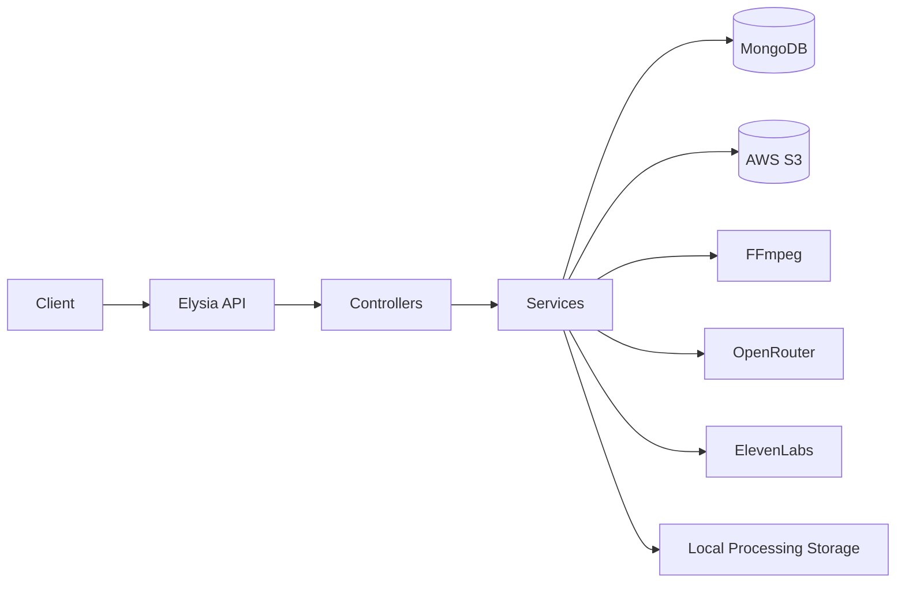
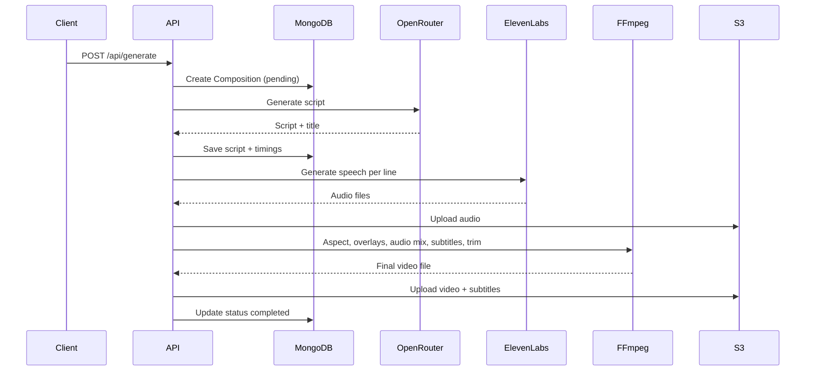

# System Architecture: Templated AI Video Generator

This document is the high-level architectural reference for the video generation API in `server/`.

## 1) System Purpose

The system generates short-form videos by combining:

- A **template video** (background gameplay or footage)
- **Characters** (static images + voice IDs)
- **AI-generated scripts** (dialogue lines)
- **Text-to-speech** (per dialogue line)
- **FFmpeg composition** (overlays, audio mixing, subtitles)

The API produces a final video URL and subtitle URL stored in S3. It also exposes a regeneration flow that reuses previously generated audio to reduce cost.

## 2) High-Level Component Diagram

Mermaid diagram (rendered in most Markdown viewers):

Request path (text overview):

1. Client calls `POST /api/generate` or `POST /api/compositions`
2. Controller validates input and calls composition service
3. Composition service:
   - Validates template and characters
   - Writes a Composition record to MongoDB
   - Starts async processing pipeline
4. Pipeline:
   - AI script generation (OpenRouter)
   - Timing calculation
   - Speech synthesis (ElevenLabs)
   - Video processing (FFmpeg)
   - Upload artifacts to S3
5. Status is updated in MongoDB for polling

Supporting subsystems:

- MongoDB for persistence (templates, characters, compositions)
- S3 for asset storage (images, audio, subtitles, final video)
- Local storage for transient processing files

## 3) Runtime and Framework

- Runtime: Bun
- API framework: ElysiaJS
- Database: MongoDB (Mongoose ODM)
- Media processing: FFmpeg (fluent-ffmpeg)
- AI: OpenRouter (LLM), ElevenLabs (TTS)
- Storage: AWS S3

## 4) Codebase Structure (Server)

Key folders in `server/src`:

- `index.ts`: Elysia app setup, middleware, routes, boot sequence
- `routes/`: HTTP route definitions and request guards
- `controllers/`: HTTP handlers; convert request to service calls
- `services/`: business logic, external integrations, pipeline steps
- `helpers/`: orchestration helpers for complex pipeline pieces
- `models/`: Mongoose schemas for templates/characters/compositions
- `db/`: database connection and seed script
- `middlewares/`: file upload (S3 or local disk) handling
- `utils/`: shared filesystem and timestamp utilities
- `types/`: shared type definitions and validation schemas

## 5) Data Model Overview

MongoDB collections:

- `Template`: background video + metadata + allowed characters
- `Character`: avatar image + voice ID + display name
- `Composition`: the generated video instance

The Composition model is the center of the pipeline. It stores:

- The template reference
- Plot text
- Screen type (`mobile` or `desktop`)
- Per-character positions (normalized, fully populated)
- Generated script and line timings
- Output and subtitle URLs
- Status and progress for polling

See [docs/data/models.md](data/models.md) for full schema details.

## 6) Processing Pipeline (Summary)

Mermaid diagram (pipeline):

1. **Validation + Setup**
   - Ensure template exists and has characters
   - Build default character positions
   - Merge custom positions and normalize
   - Create Composition record and mark as pending

2. **AI Script Generation**
   - OpenRouter generates title + dialogue lines
   - Validate character names against template characters
   - Calculate initial timing (delay + duration)

3. **Speech Generation**
   - ElevenLabs generates audio per line
   - Upload speech files to S3
   - Update line durations with actual audio length
   - Recalculate timings using actual durations

4. **Video Composition**
   - Convert template video to target aspect ratio
   - Overlay character images with position + time ranges
   - Merge audio with optional template audio
   - Generate karaoke-style ASS subtitles
   - Burn subtitles
   - Trim final video to conversation duration
   - Finalize encoding

5. **Upload + Cleanup**
   - Upload final video + subtitles to S3
   - Clean temporary local files
   - Mark composition as completed

See [docs/features/generation-pipeline.md](features/generation-pipeline.md) for detailed steps and implementation specifics.

## 7) Regeneration Flow

The regeneration endpoint reuses the stored `speechUrl` assets from previous runs:

- It re-downloads the existing speech audio from S3
- It reuses the current script and applies optional delay/screen/position updates
- It re-runs the FFmpeg pipeline without calling ElevenLabs

See [docs/features/regeneration.md](features/regeneration.md).

## 8) Subtitle System

Subtitles are karaoke-style ASS subtitles with word-by-word highlight:

- Text is split into 2-3 word chunks
- Each chunk is split into per-word lines
- Words are highlighted in the secondary color as they are spoken

See [docs/features/subtitles.md](features/subtitles.md) for the algorithm, config, and examples.

## 9) Storage and Paths

There are two storage tiers:

- **Local processing path**: transient files used during FFmpeg steps
- **S3**: canonical storage for images, audio, subtitles, and final video

See [docs/operations/storage.md](operations/storage.md) for exact folder layout and file naming.

## 10) Error Handling and Status

- Controllers return `{ success, data, error }` responses
- Composition progress is updated throughout pipeline phases
- Failed jobs are marked with status `failed` and an error string

## 11) Security and Operational Notes

- API keys are required for AI and TTS services
- S3 credentials are mandatory in production
- No auth layer is implemented in this codebase (add at gateway if needed)

## 12) Related Docs

- API details: [docs/api/endpoints.md](api/endpoints.md)
- Request validation: [docs/api/request-validation.md](api/request-validation.md)
- Core models: [docs/data/models.md](data/models.md)
- Services:
  - [docs/services/ai.md](services/ai.md)
  - [docs/services/elevenlabs.md](services/elevenlabs.md)
  - [docs/services/ffmpeg.md](services/ffmpeg.md)
  - [docs/services/s3.md](services/s3.md)
